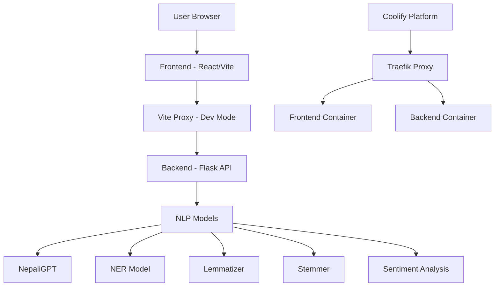

# 🇳🇵 Nepali NLP Platform

> A comprehensive web platform showcasing cutting-edge Natural Language Processing models specifically designed for the Nepali language.

[](https://opensource.org/licenses/MIT)
[](https://www.docker.com/)
[](https://coolify.io/)
[](https://reactjs.org/)
[](https://flask.palletsprojects.com/)

## 📖 Table of Contents

- [🎯 Project Overview](#-project-overview)
- [✨ Features](#-features)
- [🏗️ Architecture](#️-architecture)
- [🚀 Quick Start](#-quick-start)
- [🐳 Docker Deployment](#-docker-deployment)
- [☁️ Cloud Deployment](#️-cloud-deployment)
- [🤖 Available Models](#-available-models)
- [🌐 API Documentation](#-api-documentation)
- [🛠️ Development Guide](#️-development-guide)
- [🤝 Contributing](#-contributing)
- [📄 License](#-license)

## 🎯 Project Overview

The Nepali language, spoken by over 30 million people worldwide, has been underrepresented in the field of Natural Language Processing. This platform aims to bridge that gap by providing:

- **🌉 Language Bridge**: Accessible NLP tools for Nepali speakers
- **🔬 Research Showcase**: State-of-the-art Nepali language models
- **🚀 Innovation Platform**: Space for researchers to share their work
- **📚 Educational Resource**: Learning platform for NLP enthusiasts
- **👥 Community Hub**: Collaboration space for Nepali NLP research

### Tech Stack

**Frontend:**

- ⚛️ React 18+ with Vite
- 🎨 Tailwind CSS for styling
- 🧭 React Router for navigation
- 📱 Responsive design

**Backend:**

- 🐍 Flask 2.3+ REST API
- 🤗 Hugging Face Transformers
- 🧠 PyTorch for model inference
- 🚀 Gunicorn for production serving

**Deployment:**

- 🐳 Docker containerization
- ☁️ Coolify cloud deployment
- 🔄 CI/CD ready
- 📊 Health monitoring

## ✨ Features

### 🎯 Core Capabilities

- **Real-time Chat Interface**: Interactive chat with NLP models
- **Multiple Model Support**: Switch between different Nepali NLP models
- **Rich Text Display**: Enhanced formatting for model outputs
- **Sample Text Library**: Pre-loaded examples for each model
- **Responsive Design**: Works on desktop, tablet, and mobile

### 🔧 Technical Features

- **SSL Proxy Configuration**: Handles HTTPS certificate issues
- **Environment-based Configuration**: Separate dev/prod settings
- **Health Monitoring**: Built-in health checks for all services
- **Error Handling**: Comprehensive error management
- **Performance Optimization**: Efficient model loading and caching

## 🏗️ Architecture



### Production Architecture (Coolify)

```
Internet → Traefik (SSL/Proxy) → Frontend/Backend Containers
```

### Development Architecture

```
Browser → Vite Dev Server (Proxy) → Flask Backend
```

## � Working Production Configuration

### Backend Configuration (Currently Hosted)

**Basic Configuration:**

- Application Name: `nlp-backend`
- Base Directory: `backend`
- Build Pack: Docker
- Port: 8007 (internal container port)
- Health Check URL: `/health`

**Environment Variables:**

```env
PORT=8007
FLASK_ENV=production
PYTHONPATH=/app
PYTHONUNBUFFERED=1
TRANSFORMERS_CACHE=/app/.cache/transformers
HF_HOME=/app/.cache/huggingface
FLASK_DEBUG=0
```

**Resource Allocation:**

- Memory: 4GB minimum (8GB recommended)
- CPU: 2 vCPUs minimum
- Storage: 10GB minimum (for model downloads)
- Timeout: 300 seconds

**Available API Endpoints:**

- Health Check: `GET /health`
- Text Generation: `POST /generate`
- Named Entity Recognition: `POST /ner`
- Lemmatization: `POST /lemmatize`
- Morphological Analysis: `POST /stemmer`
- Aspect-Based Sentiment: `POST /aspect`
- Model Information: `GET /model-info`

### Frontend Configuration (Connected to Backend)

**Basic Setup:**

- Port: 8009
- Host: 0.0.0.0

**Environment Variables:**

```env
VITE_API_BASE_URL=https://nlp_backend.itclub.asmitphuyal.com.np
PORT=8009
```

**API Configuration:**

- Backend URL configured in `src/config/api.js`
- Currently points to: `https://nlp_backend.itclub.asmitphuyal.com.np`
- No port needed in public URL (handled by Coolify/Traefik)

## �🚀 Quick Start

### Prerequisites

```bash
# Required software
node --version   # v16.0.0 or higher
python --version # v3.8.0 or higher
git --version    # Latest version
docker --version # Optional, for containerization
```

### Local Development Setup

1. **Clone the Repository**

```bash
git clone https://github.com/ankitpokhrel08/nlp_project.git
cd nlp_project
```

2. **Backend Setup**

```bash
cd backend

# Create virtual environment
python3 -m venv myenv
source myenv/bin/activate  # Windows: myenv\Scripts\activate

# Install dependencies
pip install -r requirements.txt

# Start development server
python app.py
```

3. **Frontend Setup**

```bash
cd frontend

# Install dependencies
npm install

# Start development server
npm run dev
```

4. **Access the Application**

**Local Development:**

- Frontend: http://localhost:5174
- Backend API: http://localhost:5001
- Health Check: http://localhost:5001/health

**Production (Coolify):**

- Frontend: https://frontend-6zz4.onrender.com
- Backend API: https://nlp-backend.itclub.asmitphuyal.com.np:8007
- Health Check: https://nlp-backend.itclub.asmitphuyal.com.np:8007/health

## 🐳 Docker Deployment

### Single Container Deployment

**Backend Container:**

```bash
cd backend

# Build the image
docker build -t nepali-nlp-backend .

# Run the container
docker run -p 8000:8000 \
  -e PORT=8000 \
  -e FLASK_ENV=production \
  nepali-nlp-backend
```

**Frontend Container:**

```bash
cd frontend

# Build the image
docker build -t nepali-nlp-frontend .

# Run the container
docker run -p 8009:8009 \
  -e PORT=8009 \
  -e VITE_API_BASE_URL=https://your-backend-url.com \
  nepali-nlp-frontend
```

### Docker Compose Deployment

```yaml
# docker-compose.yml - For local development
version: "3.8"

services:
  backend:
    build: ./backend
    ports:
      - "8000:8000"
    environment:
      - PORT=8000
      - FLASK_ENV=production
      - PYTHONUNBUFFERED=1
    volumes:
      - model_cache:/app/.cache
    healthcheck:
      test: ["CMD", "curl", "-f", "http://localhost:8000/health"]
      interval: 30s
      timeout: 10s
      retries: 3

  frontend:
    build: ./frontend
    ports:
      - "8009:8009"
    environment:
      - PORT=8009
      - VITE_API_BASE_URL=http://backend:8000
    depends_on:
      - backend

volumes:
  model_cache:
```

```bash
# Deploy with Docker Compose
docker-compose up -d

# View logs
docker-compose logs -f

# Stop services
docker-compose down
```

## ☁️ Cloud Deployment

### Coolify Deployment

**Step 1: Prepare Your Repository**

```bash
# Ensure your code is pushed to GitHub
git add .
git commit -m "Deploy to Coolify"
git push origin main
```

**Step 2: Backend Deployment on Coolify**

1. **Create New Application**

   - Login to Coolify Dashboard
   - Click "New +" → "Application"
   - Select "Git Repository"
   - Repository: `ankitpokhrel08/nlp_project`
   - Branch: `main`

2. **Backend Configuration**

   ```yaml
   Name: nlp-backend
   Base Directory: backend
   Build Pack: Docker
   Port: 8000
   Health Check URL: /health
   ```

3. **Environment Variables**

   ```env
   PORT=8000
   FLASK_ENV=production
   PYTHONPATH=/app
   PYTHONUNBUFFERED=1
   TRANSFORMERS_CACHE=/app/.cache/transformers
   HF_HOME=/app/.cache/huggingface
   ```

4. **Resource Allocation**
   ```yaml
   CPU: 2 cores (minimum)
   Memory: 4GB (minimum for model loading)
   Storage: 10GB (for model caching)
   ```

**Step 3: Frontend Deployment on Coolify**

1. **Create New Application**

   - Follow same steps as backend
   - Different configuration:

2. **Frontend Configuration**

   ```yaml
   Name: nlp-frontend
   Base Directory: frontend
   Build Pack: Docker
   Port: 8009
   Health Check URL: /
   ```

3. **Environment Variables**
   ```env
   PORT=8009
   VITE_API_BASE_URL=https://nlp-backend.your-domain.com
   ```

**Step 4: SSL Configuration**

Coolify automatically provides SSL certificates via Let's Encrypt:

- Backend: `https://nlp-backend.itclub.asmitphuyal.com.np`
- Frontend: `https://frontend-6zz4.onrender.com`

### Other Cloud Providers

**AWS ECS:**

```bash
# Build and push to ECR
aws ecr get-login-password --region us-east-1 | docker login --username AWS --password-stdin 123456789012.dkr.ecr.us-east-1.amazonaws.com
docker build -t nepali-nlp-backend ./backend
docker tag nepali-nlp-backend:latest 123456789012.dkr.ecr.us-east-1.amazonaws.com/nepali-nlp-backend:latest
docker push 123456789012.dkr.ecr.us-east-1.amazonaws.com/nepali-nlp-backend:latest
```

**Google Cloud Run:**

```bash
# Deploy to Cloud Run
gcloud run deploy nepali-nlp-backend \
  --image gcr.io/your-project/nepali-nlp-backend \
  --platform managed \
  --region us-central1 \
  --allow-unauthenticated \
  --memory 4Gi \
  --cpu 2
```

**Railway:**

```bash
# Install Railway CLI
npm install -g @railway/cli

# Deploy
railway login
railway link
railway up
```

## 🤖 Available Models

### 1. **NepaliGPT** - Conversational AI

- **Model**: `Shushant/thesis_nepaliGPT`
- **Description**: A fine-tuned GPT model specifically trained for Nepali language generation
- **Capabilities**: Text completion, conversation, creative writing in Nepali
- **Use Cases**: Chatbots, content generation, language learning assistance

### 2. **Named Entity Recognition (NER)** - Information Extraction

- **Model**: BERT-based NER model for Nepali
- **Description**: Identifies and classifies named entities in Nepali text
- **Capabilities**: Recognizes people, places, organizations, and other entities
- **Use Cases**: Information extraction, content analysis, data mining

### 3. **Nepali Lemmatizer** - Text Normalization

- **Model**: Rule-based lemmatization system
- **Description**: Converts Nepali words to their root forms (lemmas)
- **Capabilities**: Morphological analysis, text normalization
- **Use Cases**: Search engines, text preprocessing, linguistic analysis

### 4. **Morphological Analyzer** - Linguistic Analysis

- **Model**: Comprehensive stemmer with 100+ transformation rules
- **Description**: Analyzes Nepali word structure, roots, suffixes, and grammatical patterns
- **Capabilities**: Root extraction, suffix identification, part-of-speech tagging
- **Database**: Built on Brihat Nepali Shabdakosh with 20,000+ root words
- **Use Cases**: Linguistic research, grammar checking, educational tools

### 5. **Aspect-Based Sentiment Analysis** - Opinion Mining

- **Model**: `Karinkato/Aspect_based_sentiment_analysis`
- **Description**: BERT-based model for fine-grained sentiment analysis of Nepali text
- **Capabilities**: Identifies aspect categories (GENERAL, FEEDBACK, PROFANITY, VIOLENCE) and analyzes sentiments
- **Architecture**: Built on NepalBERT for optimized Nepali language understanding
- **Use Cases**: Social media monitoring, content moderation, public opinion analysis, political text analysis

## 🌐 API Endpoints

## 🌐 API Documentation

### Base URLs

- **Development**: `http://localhost:8007`
- **Production**: `https://nlp_backend.itclub.asmitphuyal.com.np`

### Authentication

Currently, no authentication is required for API endpoints.

### Endpoints

| Endpoint      | Method | Description                     | Status    |
| ------------- | ------ | ------------------------------- | --------- |
| `/health`     | GET    | Health check                    | ✅ Active |
| `/generate`   | POST   | NepaliGPT text generation       | ✅ Active |
| `/ner`        | POST   | Named Entity Recognition        | ✅ Active |
| `/lemmatize`  | POST   | Lemmatization                   | ✅ Active |
| `/stemmer`    | POST   | Morphological analysis          | ✅ Active |
| `/aspect`     | POST   | Aspect-based sentiment analysis | ✅ Active |
| `/model-info` | GET    | Model information               | ✅ Active |

### Request/Response Examples

**Health Check:**

```bash
curl -X GET https://nlp_backend.itclub.asmitphuyal.com.np/health
```

```json
{
  "status": "healthy",
  "model_loaded": true,
  "ner_loaded": true,
  "lemmatizer_loaded": true,
  "stemmer_loaded": true,
  "aspect_loaded": true,
  "message": "NLP Models API is running"
}
}
```

**Text Generation:**

```bash
curl -X POST https://nlp_backend.itclub.asmitphuyal.com.np/generate \
  -H "Content-Type: application/json" \
  -d '{"prompt": "नेपाल एक सुन्दर देश हो", "max_length": 50}'
```

**Named Entity Recognition:**

```bash
curl -X POST https://nlp_backend.itclub.asmitphuyal.com.np/ner \
  -H "Content-Type: application/json" \
  -d '{"text": "राम काठमाडौंमा बस्छन्।"}'
```

**Lemmatization:**

```bash
curl -X POST https://nlp_backend.itclub.asmitphuyal.com.np/lemmatize \
  -H "Content-Type: application/json" \
  -d '{"text": "केटाहरु खेल्दै छन्"}'
```

**Morphological Analysis (Stemmer):**

```bash
curl -X POST https://nlp_backend.itclub.asmitphuyal.com.np/stemmer \
  -H "Content-Type: application/json" \
  -d '{"text": "केटाहरु"}'
```

**Aspect-Based Sentiment Analysis:**

```bash
curl -X POST https://nlp_backend.itclub.asmitphuyal.com.np/aspect \
  -H "Content-Type: application/json" \
  -d '{"text": "यो फिल्म राम्रो छ"}'
```

**Model Information:**

```bash
curl -X GET https://nlp_backend.itclub.asmitphuyal.com.np/model-info
```

### Rate Limiting

- **Development**: No limits
- **Production**: 100 requests per minute per IP

### Error Handling

All endpoints return consistent error responses:

```json
{
  "success": false,
  "message": "Error description",
  "error_code": "SPECIFIC_ERROR_CODE",
  "timestamp": "2025-01-20T10:30:00Z"
}
```

## 🛠️ Development Guide

### Project Structure

```
nlp_project/
├── README.md                 # Main documentation
├── docker-compose.yml        # Multi-container setup
├── .gitignore               # Git ignore rules
│
├── backend/                 # Flask API server
│   ├── app.py              # Main application
│   ├── wsgi.py             # WSGI entry point
│   ├── Dockerfile          # Container definition
│   ├── requirements.txt    # Python dependencies
│   ├── DEPLOYMENT.md       # Deployment guide
│   ├── model/              # NLP model integrations
│   └── model_tests/        # API tests
│
└── frontend/               # React application
    ├── src/                # Source code
    ├── public/             # Static assets
    ├── package.json        # Node.js dependencies
    ├── vite.config.js      # Vite configuration
    ├── Dockerfile          # Container definition
    └── README.md           # Frontend documentation
```

### Environment Configuration

**Development (.env.development):**

```env
# Frontend
VITE_API_BASE_URL=/api
PORT=5174

# Backend
FLASK_ENV=development
FLASK_DEBUG=1
PORT=5001
```

**Production (.env.production):**

```env
# Frontend
VITE_API_BASE_URL=/api
PORT=8009

# Backend
FLASK_ENV=production
FLASK_DEBUG=0
PORT=8000
PYTHONUNBUFFERED=1
```

### SSL Certificate Handling

The project includes advanced SSL handling for development:

**Vite Proxy Configuration:**

```javascript
// vite.config.js
export default defineConfig({
  server: {
    proxy: {
      "/api": {
        target: "https://nlp-backend.itclub.asmitphuyal.com.np",
        changeOrigin: true,
        secure: false, // Bypasses SSL verification
        rewrite: (path) => path.replace(/^\/api/, ""),
      },
    },
  },
});
```

This configuration:

- ✅ Handles untrusted SSL certificates
- ✅ Enables CORS for cross-origin requests
- ✅ Provides seamless development experience
- ✅ No need to manually accept certificates

### Testing

**Backend API Tests:**

```bash
cd backend
python -m pytest model_tests/ -v
```

**Frontend Component Tests:**

```bash
cd frontend
npm test
```

**Integration Tests:**

```bash
# Ensure both services are running
npm run test:integration
```

### Code Quality

**Linting:**

```bash
# Frontend
npm run lint

# Backend
flake8 backend/ --max-line-length=88
black backend/ --check
```

**Pre-commit Hooks:**

```bash
# Install pre-commit
pip install pre-commit
pre-commit install

# Run manually
pre-commit run --all-files
```

## 🚀 Performance Optimization

### Backend Optimization

**Model Caching:**

```python
# Efficient model loading with caching
@lru_cache(maxsize=None)
def load_model(model_name):
    return AutoModel.from_pretrained(model_name)
```

**Gunicorn Configuration:**

```bash
# Production server configuration
gunicorn --workers=4 --worker-class=sync --worker-connections=1000 \
         --timeout=300 --bind=0.0.0.0:8000 wsgi:application
```

### Frontend Optimization

**Build Optimization:**

```javascript
// vite.config.js
export default defineConfig({
  build: {
    rollupOptions: {
      output: {
        manualChunks: {
          vendor: ["react", "react-dom"],
          router: ["react-router-dom"],
        },
      },
    },
  },
});
```

**Lazy Loading:**

```javascript
// Lazy load heavy components
const NERChat = lazy(() => import("./components/NERChat"));
const Chat = lazy(() => import("./components/Chat"));
```

## 📊 Monitoring and Logging

### Health Monitoring

**Backend Health Endpoint:**

```python
@app.route('/health')
def health_check():
    return {
        'status': 'healthy',
        'models_loaded': model_loaded,
        'memory_usage': psutil.virtual_memory().percent,
        'timestamp': datetime.utcnow().isoformat()
    }
```

**Frontend Monitoring:**

```javascript
// Monitor API connectivity
const checkBackendHealth = async () => {
  try {
    const response = await fetch("/api/health");
    return response.ok;
  } catch (error) {
    console.error("Backend health check failed:", error);
    return false;
  }
};
```

### Logging Configuration

**Backend Logging:**

```python
import logging
logging.basicConfig(
    level=logging.INFO,
    format='%(asctime)s - %(name)s - %(levelname)s - %(message)s'
)
```

**Frontend Error Tracking:**

```javascript
// Error boundary for React components
class ErrorBoundary extends React.Component {
  componentDidCatch(error, errorInfo) {
    console.error("Frontend error:", error, errorInfo);
    // Send to monitoring service
  }
}
```

## 🔒 Security Considerations

### API Security

- **CORS Configuration**: Properly configured for cross-origin requests
- **Input Validation**: All user inputs are validated and sanitized
- **Rate Limiting**: Protection against abuse (production only)
- **HTTPS Enforcement**: All production traffic uses SSL/TLS

### Container Security

- **Non-root User**: Containers run with limited privileges
- **Minimal Base Images**: Using Alpine Linux for smaller attack surface
- **Dependency Scanning**: Regular security updates for dependencies

### Data Privacy

- **No Data Storage**: Text inputs are processed in memory only
- **Model Privacy**: All processing happens server-side
- **GDPR Compliance**: No personal data collection or storage

## 🤝 Contributing

We welcome contributions from the Nepali NLP community! Whether you're fixing bugs, adding features, or contributing new models, your help is appreciated.

### 🚀 Quick Start for Contributors

1. **Fork and Clone**

```bash
git fork https://github.com/ankitpokhrel08/nlp_project.git
git clone https://github.com/your-username/nlp_project.git
cd nlp_project
```

2. **Set Up Development Environment**

```bash
# Backend setup
cd backend
python -m venv myenv
source myenv/bin/activate  # Windows: myenv\Scripts\activate
pip install -r requirements.txt

# Frontend setup
cd ../frontend
npm install
```

3. **Create Feature Branch**

```bash
git checkout -b feature/your-feature-name
```

4. **Make Changes and Test**

```bash
# Run backend tests
cd backend && python -m pytest

# Run frontend tests
cd frontend && npm test

# Test integration
docker-compose up -d
```

5. **Submit Pull Request**

```bash
git add .
git commit -m "feat: add your feature description"
git push origin feature/your-feature-name
```

### 🎯 Contributing Your NLP Model

**Requirements for Model Contributions:**

- ✅ **Nepali Language Focus**: Models specifically designed for Nepali text
- ✅ **Open Source License**: Compatible with MIT license
- ✅ **Quality Documentation**: Clear usage examples and performance metrics
- ✅ **API Integration**: Proper Flask endpoint implementation
- ✅ **Testing**: Comprehensive test coverage
- ✅ **Performance**: Reasonable inference time (< 5s per request)

**Step-by-Step Model Integration:**

1. **Backend Integration**

```python
# backend/model/your_model/app.py
from transformers import pipeline

class YourModel:
    def __init__(self):
        self.model = pipeline("your-task", model="your-model-name")

    def predict(self, text):
        return self.model(text)

# backend/app.py
@app.route('/your-endpoint', methods=['POST'])
def your_model_endpoint():
    data = request.get_json()
    result = your_model.predict(data['text'])
    return jsonify({"success": True, "result": result})
```

2. **Frontend Integration**

```javascript
// frontend/src/constants/index.js
export const models = [
  // ... existing models
  {
    id: "your-model",
    title: "Your Model Name",
    description: "Brief description of your model capabilities",
    endpoint: "/your-endpoint",
    route: "/chat/your-model",
    // ... other properties
  },
];
```

3. **Documentation**

```markdown
# Add to README.md

### Your Model Name

- **Model**: `your-huggingface-model-name`
- **Description**: Detailed description of capabilities
- **Use Cases**: Practical applications
- **Performance**: Accuracy metrics and benchmarks
```

### 🐛 Bug Reports

**Before submitting a bug report:**

- [ ] Check existing issues
- [ ] Verify bug in latest version
- [ ] Test with minimal reproduction case

**Bug Report Template:**

```markdown
**Bug Description**
Clear description of the bug

**Steps to Reproduce**

1. Go to '...'
2. Click on '...'
3. Enter text '...'
4. See error

**Expected Behavior**
What should happen

**Environment**

- OS: [e.g., macOS 12.0]
- Browser: [e.g., Chrome 96]
- Node.js: [e.g., 16.14.0]
- Python: [e.g., 3.9.7]

**Additional Context**
Screenshots, logs, or other relevant information
```

### 💡 Feature Requests

**Feature Request Template:**

```markdown
**Feature Description**
Clear description of the proposed feature

**Problem Statement**
What problem does this solve?

**Proposed Solution**
How should this feature work?

**Alternatives Considered**
Other solutions you've considered

**Additional Context**
Mockups, examples, or references
```

### 🔍 Code Review Process

**Review Criteria:**

- [ ] **Functionality**: Code works as intended
- [ ] **Performance**: No significant performance regression
- [ ] **Security**: No security vulnerabilities introduced
- [ ] **Testing**: Adequate test coverage (>80%)
- [ ] **Documentation**: Updated documentation and comments
- [ ] **Style**: Follows project coding standards

**Review Timeline:**

- **Initial Response**: Within 2 business days
- **Full Review**: Within 1 week
- **Merge Decision**: Within 2 weeks

### 🏆 Recognition

**Contributors Wall of Fame:**

- **Core Team**: [@ankitpokhrel08](https://github.com/ankitpokhrel08)
- **Model Contributors**: [Your name could be here!]
- **Bug Hunters**: [Your name could be here!]
- **Documentation Writers**: [Your name could be here!]

**Contribution Types:**

- 🚀 **New Models**: Adding NLP models
- 🐛 **Bug Fixes**: Fixing issues
- 📚 **Documentation**: Improving docs
- 🎨 **UI/UX**: Design improvements
- ⚡ **Performance**: Optimization work
- 🔧 **DevOps**: Infrastructure improvements

## 📄 License

This project is licensed under the **MIT License** - see the [LICENSE](LICENSE) file for details.

### 🤝 Third-Party Licenses

**Backend Dependencies:**

- **Flask**: BSD-3-Clause License
- **Transformers**: Apache License 2.0
- **PyTorch**: BSD-3-Clause License
- **Gunicorn**: MIT License

**Frontend Dependencies:**

- **React**: MIT License
- **Vite**: MIT License
- **Tailwind CSS**: MIT License
- **React Router**: MIT License

**Models:**

- **NepaliGPT**: [Model-specific license]
- **XLM-RoBERTa**: MIT License
- **Other models**: See individual model cards

### 📜 Copyright Notice

```
MIT License

Copyright (c) 2025 PUL079BCTA

Permission is hereby granted, free of charge, to any person obtaining a copy
of this software and associated documentation files (the "Software"), to deal
in the Software without restriction, including without limitation the rights
to use, copy, modify, merge, publish, distribute, sublicense, and/or sell
copies of the Software, and to permit persons to whom the Software is
furnished to do so, subject to the following conditions:

The above copyright notice and this permission notice shall be included in all
copies or substantial portions of the Software.

THE SOFTWARE IS PROVIDED "AS IS", WITHOUT WARRANTY OF ANY KIND, EXPRESS OR
IMPLIED, INCLUDING BUT NOT LIMITED TO THE WARRANTIES OF MERCHANTABILITY,
FITNESS FOR A PARTICULAR PURPOSE AND NONINFRINGEMENT. IN NO EVENT SHALL THE
AUTHORS OR COPYRIGHT HOLDERS BE LIABLE FOR ANY CLAIM, DAMAGES OR OTHER
LIABILITY, WHETHER IN AN ACTION OF CONTRACT, TORT OR OTHERWISE, ARISING FROM,
OUT OF OR IN CONNECTION WITH THE SOFTWARE OR THE USE OR OTHER DEALINGS IN THE
SOFTWARE.
```

## 🙏 Acknowledgments

### 🎓 Academic Contributions

- **Thesis Supervisor**: [Supervisor Name]
- **University**: [University Name]
- **Research Group**: Nepali NLP Research Community

### 🤗 Open Source Community

- **Hugging Face**: For providing model hosting and transformers library
- **React Team**: For the excellent frontend framework
- **Flask Team**: For the lightweight and flexible backend framework
- **Tailwind CSS**: For the utility-first CSS framework

### 🇳🇵 Nepali NLP Community

- **Model Creators**: All researchers who contributed models
- **Dataset Creators**: Teams who created training datasets
- **Community Members**: Everyone who provided feedback and suggestions

### 🏢 Infrastructure

- **Coolify**: For providing deployment platform
- **GitHub**: For version control and collaboration
- **Docker**: For containerization technology

## � Troubleshooting

### SSL Certificate Issues

**Problem**: Frontend cannot connect to backend due to SSL certificate errors

**For Production Deployments:**

1. **Accept Certificate Manually**: Visit the backend URL directly and accept the certificate

   ```
   https://nlp_backend.itclub.asmitphuyal.com.np
   ```

   - Click "Advanced" → "Proceed to nlp_backend.itclub.asmitphuyal.com.np (unsafe)"
   - Return to frontend application and try again

2. **Backend Health Check**: Verify backend is accessible
   ```bash
   curl -k https://nlp_backend.itclub.asmitphuyal.com.np/health
   ```

**For Development:**

- The Vite proxy is already configured to handle SSL issues automatically
- No manual intervention required

### Common Deployment Issues

**Frontend not connecting to backend:**

````bash
**Frontend not connecting to backend:**
```bash
# Check if backend is running
curl -k https://nlp_backend.itclub.asmitphuyal.com.np/health

# Check CORS headers
curl -k -I -X OPTIONS https://nlp_backend.itclub.asmitphuyal.com.np/generate
````

````

**Docker container issues:**

```bash
# Check container logs
docker logs <container-name>

# Restart containers
docker-compose down && docker-compose up -d
````

**Port conflicts:**

- Frontend: Port 8009
- Backend: Port 8007
- Ensure these ports are available and properly configured

## �📞 Contact & Support

### 👥 Team

- **Lead Developer**: [@ankitpokhrel08](https://github.com/ankitpokhrel08)
- **Project ID**: PUL079BCTA
- **Institution**: [University Name]

### 📧 Contact Information

- **Email**: [your-email@domain.com]
- **GitHub Issues**: [Project Issues](https://github.com/ankitpokhrel08/nlp_project/issues)
- **Discussions**: [GitHub Discussions](https://github.com/ankitpokhrel08/nlp_project/discussions)

### 🆘 Support Channels

- **Bug Reports**: Use GitHub Issues with bug template
- **Feature Requests**: Use GitHub Issues with feature template
- **General Questions**: Use GitHub Discussions
- **Security Issues**: Email directly to maintainers

### 🌐 Community

- **Discord**: [Join our Discord server] (if available)
- **Twitter**: [@NepalNLP] (if available)
- **LinkedIn**: [Nepali NLP Group] (if available)

---

<div align="center">

**🎯 Made with ❤️ for the Nepali NLP community**

[](https://github.com/ankitpokhrel08/nlp_project)
[](https://github.com/ankitpokhrel08/nlp_project/fork)
[](https://github.com/ankitpokhrel08/nlp_project)

**[⭐ Star this project](https://github.com/ankitpokhrel08/nlp_project) • [🍴 Fork and contribute](https://github.com/ankitpokhrel08/nlp_project/fork) • [📄 View documentation](https://github.com/ankitpokhrel08/nlp_project/blob/main/README.md)**

</div>
