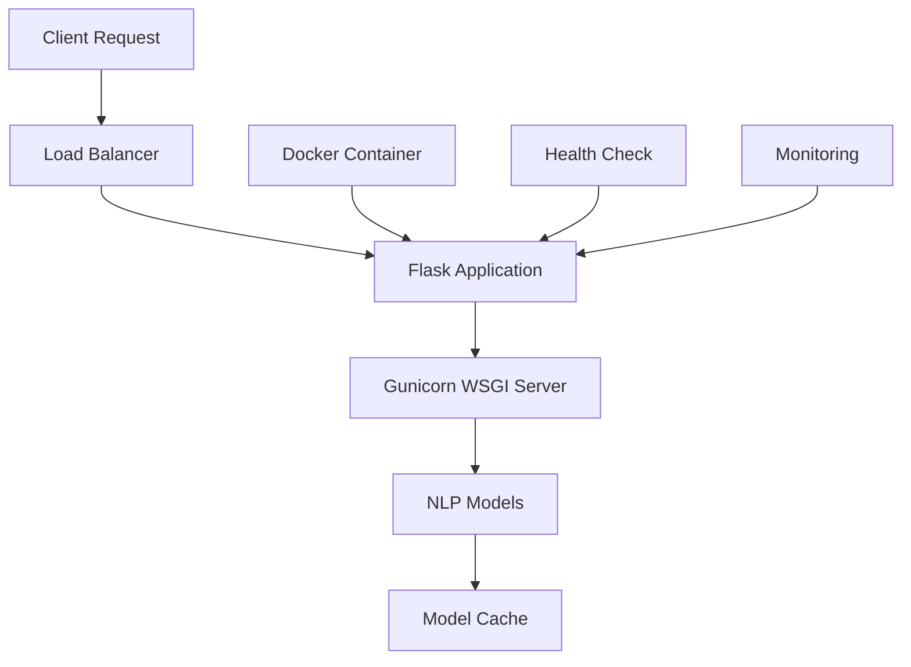

# 🚀 Backend Deployment Guide

> Comprehensive deployment guide for the Nepali NLP Backend API

## 📋 Overview

This guide covers multiple deployment strategies for the Flask-based backend API that serves Nepali NLP models. The backend is designed to be cloud-native and supports various deployment platforms.

## 🏗️ Architecture



## ✅ Pre-Deployment Checklist

### Required Files

- ✅ `Dockerfile` - Production container definition
- ✅ `Dockerfile.optimized` - Multi-stage build option
- ✅ `Dockerfile.simple` - Lightweight fallback
- ✅ `.dockerignore` - Build optimization
- ✅ `requirements.txt` - Python dependencies with Gunicorn
- ✅ `app.py` - Production-ready Flask application
- ✅ `wsgi.py` - WSGI entry point for production servers
- ✅ `nixpacks.toml` - Nixpacks configuration for some platforms
- ✅ `.env.production` - Production environment variables

### Configuration Verification

```bash
# Check Python dependencies
pip check

# Verify Flask app starts
python app.py

# Test WSGI entry point
gunicorn --check-config wsgi:application

# Validate Docker build
docker build --no-cache -t test-build .
```

## 🐳 Docker Deployment

### Container Options

We provide multiple Docker configurations based on your needs:

#### 1. Production Dockerfile (Recommended)

```dockerfile
# Optimized for production with caching and security
FROM python:3.11-slim as base
WORKDIR /app
COPY requirements.txt .
RUN pip install --no-cache-dir -r requirements.txt
COPY . .
EXPOSE 8000
CMD ["gunicorn", "--bind", "0.0.0.0:8000", "--workers", "4", "wsgi:application"]
```

#### 2. Multi-stage Dockerfile

```dockerfile
# Two-stage build for smaller final image
FROM python:3.11 as builder
# ... build dependencies ...
FROM python:3.11-slim as runtime
# ... runtime setup ...
```

#### 3. Simple Dockerfile

```dockerfile
# Minimal setup for testing
FROM python:3.11-slim
# ... basic configuration ...
```

### Local Docker Deployment

```bash
# Build the container
docker build -t nepali-nlp-backend .

# Run with basic configuration
docker run -p 8000:8000 nepali-nlp-backend

# Run with environment variables
docker run -p 8000:8000 \
  -e PORT=8000 \
  -e FLASK_ENV=production \
  -e PYTHONUNBUFFERED=1 \
  nepali-nlp-backend

# Run with volume for model caching
docker run -p 8000:8000 \
  -v $(pwd)/.cache:/app/.cache \
  -e TRANSFORMERS_CACHE=/app/.cache/transformers \
  nepali-nlp-backend
```

### Docker Compose Deployment

```yaml
# docker-compose.yml
version: "3.8"

services:
  backend:
    build:
      context: .
      dockerfile: Dockerfile
    ports:
      - "8000:8000"
    environment:
      - PORT=8000
      - FLASK_ENV=production
      - PYTHONUNBUFFERED=1
      - TRANSFORMERS_CACHE=/app/.cache/transformers
      - HF_HOME=/app/.cache/huggingface
    volumes:
      - model_cache:/app/.cache
      - ./logs:/app/logs
    healthcheck:
      test: ["CMD", "curl", "-f", "http://localhost:8000/health"]
      interval: 30s
      timeout: 10s
      retries: 3
      start_period: 60s
    restart: unless-stopped
    deploy:
      resources:
        limits:
          memory: 4G
          cpus: "2.0"
        reservations:
          memory: 2G
          cpus: "1.0"

volumes:
  model_cache:
    driver: local

networks:
  default:
    name: nepali-nlp-network
```

```bash
# Deploy with Docker Compose
docker-compose up -d

# View logs
docker-compose logs -f backend

# Scale services (if needed)
docker-compose up -d --scale backend=3

# Stop and remove
docker-compose down -v
```

## ☁️ Coolify Deployment

### Step 1: Repository Preparation

```bash
# Ensure your repository is ready
git add .
git commit -m "feat: prepare for Coolify deployment"
git push origin main

# Tag a release (optional)
git tag -a v1.0.0 -m "Initial production release"
git push origin v1.0.0
```

### Step 2: Coolify Application Setup

1. **Login to Coolify Dashboard**

   - Navigate to your Coolify instance
   - Login with your credentials

2. **Create New Application**

   ```yaml
   Application Type: Git Repository
   Repository: ankitpokhrel08/nlp_project
   Branch: main
   ```

3. **Basic Configuration**
   ```yaml
   Name: nlp-backend
   Description: Nepali NLP Backend API
   Base Directory: backend
   Build Pack: Docker
   Port: 8007
   Health Check URL: /health
   Health Check Interval: 30s
   ```

### Step 3: Environment Configuration

**Required Environment Variables (Tested & Working):**

```env
# Core Flask Configuration
PORT=8007
FLASK_ENV=production
FLASK_DEBUG=0
PYTHONUNBUFFERED=1

# Python Path Configuration
PYTHONPATH=/app

# Model Caching Configuration
TRANSFORMERS_CACHE=/app/.cache/transformers
HF_HOME=/app/.cache/huggingface

# Performance Tuning (Optional)
TOKENIZERS_PARALLELISM=false
OMP_NUM_THREADS=2
```

### Step 4: Resource Allocation (Working Configuration)

```yaml
# Resource Requirements
Memory: 4GB minimum (8GB recommended)
CPU: 2 vCPUs minimum
Storage: 10GB minimum (for model downloads)
Timeout: 300 seconds
```

### Step 5: Docker Configuration Details

```yaml
# Container Specifications
Base Image: Python 3.11-slim
Working Directory: /app
Exposed Port: 8007
Health Check: Every 30 seconds
Model Cache: Persistent volumes included
```

### Step 6: Available API Endpoints

Once deployed, your backend will serve these endpoints:

```yaml
Health Check: GET /health
Text Generation: POST /generate
Named Entity Recognition: POST /ner
Lemmatization: POST /lemmatize
Morphological Analysis: POST /stemmer
Aspect-Based Sentiment: POST /aspect
Model Information: GET /model-info
```

**Optional Environment Variables:**

```env
# Logging Configuration
LOG_LEVEL=INFO
LOG_FORMAT=json

# Security Headers
SECURITY_HEADERS_ENABLED=true

# Model Configuration
MAX_SEQUENCE_LENGTH=512
MODEL_CACHE_TIMEOUT=3600
```

### Step 4: Resource Allocation

**Minimum Requirements:**

```yaml
CPU: 2 cores
Memory: 4GB RAM
Storage: 10GB SSD
```

**Recommended for Production:**

```yaml
CPU: 4 cores
Memory: 8GB RAM
Storage: 20GB SSD
```

**High-Load Configuration:**

```yaml
CPU: 8 cores
Memory: 16GB RAM
Storage: 50GB SSD
```

### Step 5: Advanced Coolify Configuration

**Custom Build Command:**

```bash
# If needed, override default build
docker build --target production -t $IMAGE_NAME .
```

**Custom Start Command:**

```bash
# Override default CMD if necessary
gunicorn --config gunicorn.conf.py wsgi:application
```

**Health Check Configuration:**

```yaml
Health Check URL: /health
Health Check Method: GET
Health Check Headers:
  Accept: application/json
Expected Status Code: 200
Health Check Timeout: 10s
Health Check Interval: 30s
Health Check Retries: 3
```

### Step 6: SSL and Domain Configuration

**Custom Domain Setup:**

```yaml
Domain: nlp-backend.itclub.asmitphuyal.com.np
SSL Certificate: Let's Encrypt (Auto)
Force HTTPS: Enabled
HSTS: Enabled
```

**DNS Configuration:**

```dns
Type: CNAME
Name: nlp-backend
Value: your-coolify-instance.com
TTL: 300
```

## 🌐 Alternative Cloud Deployments

### AWS ECS Deployment

1. **Create ECR Repository:**

```bash
aws ecr create-repository --repository-name nepali-nlp-backend
```

2. **Build and Push Image:**

```bash
# Get login token
aws ecr get-login-password --region us-east-1 | docker login --username AWS --password-stdin 123456789012.dkr.ecr.us-east-1.amazonaws.com

# Build and tag
docker build -t nepali-nlp-backend .
docker tag nepali-nlp-backend:latest 123456789012.dkr.ecr.us-east-1.amazonaws.com/nepali-nlp-backend:latest

# Push to ECR
docker push 123456789012.dkr.ecr.us-east-1.amazonaws.com/nepali-nlp-backend:latest
```

3. **ECS Task Definition:**

```json
{
  "family": "nepali-nlp-backend",
  "networkMode": "awsvpc",
  "requiresCompatibilities": ["FARGATE"],
  "cpu": "2048",
  "memory": "4096",
  "containerDefinitions": [
    {
      "name": "nepali-nlp-backend",
      "image": "123456789012.dkr.ecr.us-east-1.amazonaws.com/nepali-nlp-backend:latest",
      "portMappings": [
        {
          "containerPort": 8000,
          "protocol": "tcp"
        }
      ],
      "environment": [
        { "name": "PORT", "value": "8000" },
        { "name": "FLASK_ENV", "value": "production" }
      ],
      "logConfiguration": {
        "logDriver": "awslogs",
        "options": {
          "awslogs-group": "/ecs/nepali-nlp-backend",
          "awslogs-region": "us-east-1",
          "awslogs-stream-prefix": "ecs"
        }
      }
    }
  ]
}
```

### Google Cloud Run

```bash
# Build and deploy to Cloud Run
gcloud builds submit --tag gcr.io/your-project-id/nepali-nlp-backend

gcloud run deploy nepali-nlp-backend \
  --image gcr.io/your-project-id/nepali-nlp-backend \
  --platform managed \
  --region us-central1 \
  --allow-unauthenticated \
  --memory 4Gi \
  --cpu 2 \
  --timeout 300 \
  --concurrency 10 \
  --set-env-vars PORT=8000,FLASK_ENV=production
```

### Digital Ocean App Platform

```yaml
# .do/app.yaml
name: nepali-nlp-backend
services:
  - name: backend
    source_dir: backend
    github:
      repo: ankitpokhrel08/nlp_project
      branch: main
    run_command: gunicorn --bind 0.0.0.0:8000 wsgi:application
    environment_slug: python
    instance_count: 1
    instance_size_slug: professional-s
    envs:
      - key: PORT
        value: "8000"
      - key: FLASK_ENV
        value: production
    health_check:
      http_path: /health
```

### Railway Deployment

```bash
# Install Railway CLI
npm install -g @railway/cli

# Login and deploy
railway login
railway link
railway up
```

**railway.toml:**

```toml
[build]
builder = "DOCKERFILE"
dockerfilePath = "Dockerfile"

[deploy]
healthcheckPath = "/health"
healthcheckTimeout = 300
restartPolicyType = "ON_FAILURE"
restartPolicyMaxRetries = 10
```

## 📊 Monitoring and Maintenance

### Health Monitoring

**Health Check Endpoint:**

```python
@app.route('/health')
def health_check():
    return {
        'status': 'healthy',
        'timestamp': datetime.utcnow().isoformat(),
        'models_loaded': model_loaded,
        'memory_usage': psutil.virtual_memory().percent,
        'disk_usage': psutil.disk_usage('/').percent,
        'uptime': time.time() - start_time
    }
```

**External Monitoring:**

```bash
# Setup monitoring with curl
*/5 * * * * curl -f https://nlp-backend.itclub.asmitphuyal.com.np/health || echo "Backend down" | mail admin@example.com
```

### Logging Configuration

**Production Logging:**

```python
import logging
import json
from pythonjsonlogger import jsonlogger

# Configure JSON logging for production
handler = logging.StreamHandler()
formatter = jsonlogger.JsonFormatter(
    '%(asctime)s %(name)s %(levelname)s %(message)s'
)
handler.setFormatter(formatter)
logger.addHandler(handler)
logger.setLevel(logging.INFO)
```

### Performance Optimization

**Gunicorn Configuration:**

```python
# gunicorn.conf.py
bind = "0.0.0.0:8000"
workers = 4
worker_class = "sync"
worker_connections = 1000
timeout = 300
keepalive = 2
max_requests = 1000
max_requests_jitter = 100
preload_app = True
```

**Model Caching:**

```python
from functools import lru_cache

@lru_cache(maxsize=None)
def load_model(model_name):
    """Cache loaded models to improve performance"""
    return pipeline("text-generation", model=model_name)
```

## 🔧 Troubleshooting

### Common Issues

**Issue 1: Models not loading**

```bash
# Check available memory
free -h

# Check model cache
ls -la /app/.cache/transformers/

# Clear cache if corrupted
rm -rf /app/.cache/transformers/*
```

**Issue 2: High memory usage**

```bash
# Monitor memory usage
docker stats

# Reduce model precision
export TRANSFORMERS_CACHE_PRECISION=fp16
```

**Issue 3: Slow response times**

```bash
# Check worker configuration
ps aux | grep gunicorn

# Optimize worker count
export WORKERS=$(python -c "import multiprocessing; print(multiprocessing.cpu_count() * 2 + 1)")
```

### Debug Commands

```bash
# Container debugging
docker exec -it container_name bash
docker logs -f container_name

# Application debugging
curl -X GET https://nlp-backend.itclub.asmitphuyal.com.np/health
curl -X POST https://nlp-backend.itclub.asmitphuyal.com.np/generate -H "Content-Type: application/json" -d '{"prompt": "test"}'

# Performance testing
ab -n 100 -c 10 https://nlp-backend.itclub.asmitphuyal.com.np/health
```

## 🚀 Production Deployment Checklist

### Pre-Deployment

- [ ] All tests passing
- [ ] Environment variables configured
- [ ] SSL certificates ready
- [ ] Database connections tested (if applicable)
- [ ] Monitoring setup complete

### Deployment

- [ ] Build successful
- [ ] Health checks passing
- [ ] All endpoints responding
- [ ] Performance within acceptable limits
- [ ] Logs being collected

### Post-Deployment

- [ ] Smoke tests completed
- [ ] Monitoring alerts configured
- [ ] Documentation updated
- [ ] Team notified
- [ ] Rollback plan ready

---

**🎯 Deployment completed successfully!** Your Nepali NLP Backend is now ready to serve requests at scale.

### Step 4: Resource Allocation

**Important for ML Models:**

- **Memory**: 4GB minimum (8GB recommended)
- **CPU**: 2 vCPUs minimum
- **Storage**: 10GB minimum (for model downloads)
- **Timeout**: 300 seconds (models take time to load)

### Step 5: Build Configuration

**Option A - Docker (Recommended):**

- Build Pack: `Docker`
- Dockerfile: `Dockerfile` (main)
- Build Command: (leave empty, uses Dockerfile)
- Start Command: (leave empty, uses Dockerfile CMD)

**Option B - Nixpacks (Alternative):**

- Build Pack: `Nixpacks`
- Start Command: `python app.py`
- Install Command: `pip install -r requirements.txt`

**Option C - Simple Docker (Fallback):**

- Rename `Dockerfile.simple` to `Dockerfile` if main fails
- Use for minimal setup

## 🚀 Deployment Steps

### 1. Push Changes

```bash
git add .
git commit -m "Configure backend for Coolify deployment"
git push origin main
```

### 2. Deploy in Coolify

1. Click **"Deploy"** in Coolify dashboard
2. Monitor build logs for any errors
3. Wait for health check to pass (may take 2-5 minutes)

### 3. Verify Deployment

Once deployed, test the health endpoint:

```bash
curl https://your-backend-url.com/health
```

Expected response:

```json
{
  "status": "healthy",
  "model_loaded": true,
  "ner_loaded": true,
  "lemmatizer_loaded": true,
  "stemmer_loaded": true,
  "aspect_loaded": true,
  "message": "NLP Models API is running"
}
```

## 🔧 API Endpoints

After deployment, your API will be available at:

- **Health Check**: `GET /health`
- **Text Generation**: `POST /generate`
- **NER**: `POST /ner`
- **Lemmatization**: `POST /lemmatize`
- **Stemming**: `POST /stem`
- **Aspect Sentiment**: `POST /aspect-sentiment`

## 🔍 Troubleshooting

### Build Fails?

1. **Check Coolify build logs**
2. **Try alternative Dockerfiles**:
   - Rename `Dockerfile.optimized` to `Dockerfile`
   - Or use `Dockerfile.simple` for minimal setup
3. **Verify resource limits** (memory, CPU)

### Models Don't Load?

1. **Increase memory allocation** (8GB recommended)
2. **Increase timeout** to 300+ seconds
3. **Check logs** for specific model download errors

### Port Issues?

1. **Verify PORT=8000** in environment variables
2. **Check Coolify port mapping**
3. **Ensure health check uses correct port**

### Performance Issues?

1. **Use Gunicorn**: Set start command to `gunicorn --bind 0.0.0.0:8000 --workers 1 --timeout 300 wsgi:app`
2. **Increase worker memory**
3. **Monitor resource usage**

## 📝 Important Notes

1. **First deployment will be slow** (10-15 min) due to model downloads
2. **Subsequent deployments** will be faster with cached models
3. **Models require significant RAM** - don't skimp on memory allocation
4. **Health check may take 2-5 minutes** to return healthy status

## 🔄 Next Steps: Frontend Deployment

After backend is successfully deployed:

1. **Note the backend URL** from Coolify
2. **Update frontend API endpoints** to use your backend URL
3. **Deploy frontend** as separate application
4. **Update CORS settings** if needed

**Backend URL Format**: `https://nlp-backend-xxx.your-domain.com`

---

## ⚡ Quick Deploy Commands

If you need to redeploy quickly:

```bash
# In your local backend directory
git add . && git commit -m "Update backend config" && git push

# Then click "Deploy" in Coolify dashboard
```

Your backend should now be production-ready! 🎉
