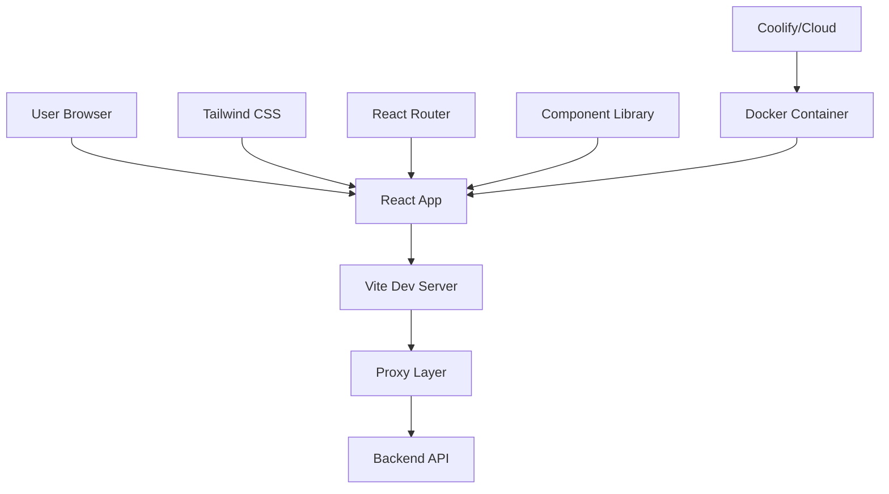

# 🎨 Frontend - Nepali NLP Platform

> Modern React-based frontend for the Nepali NLP Platform with advanced deployment capabilities

[](https://reactjs.org/)
[](https://vitejs.dev/)
[](https://tailwindcss.com/)
[](https://www.docker.com/)

## 📋 Overview

The frontend is a modern, responsive React application built with Vite and styled with Tailwind CSS. It provides an intuitive interface for interacting with various Nepali NLP models through real-time chat interfaces.

## 🏗️ Architecture



## ✨ Features

### 🎯 Core Features

- **Interactive Chat Interface**: Real-time communication with NLP models
- **Model Switching**: Easy navigation between different NLP models
- **Rich Text Display**: Enhanced formatting for model outputs
- **Sample Text Library**: Pre-loaded examples for each model
- **Responsive Design**: Works seamlessly on desktop, tablet, and mobile

### 🔧 Technical Features

- **SSL Proxy Support**: Handles HTTPS certificate issues transparently
- **Environment-based Configuration**: Separate configurations for dev/prod
- **Hot Module Replacement**: Fast development with instant updates
- **Code Splitting**: Optimized bundle sizes with lazy loading
- **Error Boundaries**: Comprehensive error handling

### 🎨 UI/UX Features

- **Modern Design**: Clean, professional interface
- **Dark Theme**: Eye-friendly dark color scheme
- **Animations**: Smooth transitions and loading states
- **Accessibility**: WCAG compliant interface
- **Progressive Web App**: Installable and offline-capable

## 🚀 Quick Start

### Prerequisites

```bash
node --version    # v16.0.0 or higher
npm --version     # v8.0.0 or higher
```

### Development Setup

1. **Install Dependencies**

```bash
cd frontend
npm install
```

2. **Environment Configuration**

```bash
# Create development environment file
cp .env.example .env.development

# Edit configuration
VITE_API_BASE_URL=/api
PORT=5174
```

3. **Start Development Server**

```bash
npm run dev
```

4. **Access Application**

- Frontend: http://localhost:5174
- Proxy API: http://localhost:5174/api/\*

### Build for Production

```bash
# Build optimized production bundle
npm run build

# Preview production build locally
npm run preview

# Serve built files (alternative)
npm start
```

## 🐳 Docker Deployment

### Dockerfile Configuration

The project includes an optimized Dockerfile for production deployment:

```dockerfile
# Multi-stage build for optimal size
FROM node:18-alpine as build
WORKDIR /app
COPY package*.json ./
RUN npm ci --only=production && npm cache clean --force
COPY . .
RUN npm run build

FROM node:18-alpine as runtime
WORKDIR /app
RUN npm install -g serve
COPY --from=build /app/dist ./dist
EXPOSE 8009
CMD ["serve", "-s", "dist", "-l", "8009", "-d"]
```

### Local Docker Deployment

```bash
# Build the container
docker build -t nepali-nlp-frontend .

# Run with basic configuration
docker run -p 8009:8009 nepali-nlp-frontend

# Run with environment variables
docker run -p 8009:8009 \
  -e PORT=8009 \
  -e VITE_API_BASE_URL=https://your-backend-url.com \
  nepali-nlp-frontend

# Run with custom configuration
docker run -p 8009:8009 \
  -e PORT=8009 \
  -e VITE_API_BASE_URL=/api \
  -v $(pwd)/dist:/app/dist \
  nepali-nlp-frontend
```

## ☁️ Cloud Deployment

### Coolify Deployment

**Step 1: Repository Setup**

```bash
# Ensure code is committed and pushed
git add .
git commit -m "feat: prepare frontend for deployment"
git push origin main
```

**Step 2: Coolify Configuration**

1. **Create New Application**

   ```yaml
   Application Type: Git Repository
   Repository: ankitpokhrel08/nlp_project
   Branch: main
   Base Directory: frontend
   ```

2. **Build Configuration (Working Configuration)**

   ```yaml
   Name: nlp-frontend
   Description: Nepali NLP Platform Frontend
   Build Pack: Docker
   Port: 8009
   Health Check URL: /
   ```

3. **Environment Variables (Tested & Working)**

   ```env
   # Core Configuration
   PORT=8009
   NODE_ENV=production

   # API Configuration (No port needed in public URL)
   VITE_API_BASE_URL=https://nlp_backend.itclub.asmitphuyal.com.np

   # Build Configuration
   GENERATE_SOURCEMAP=false
   CI=false
   ```

4. **Advanced Settings**

   ```yaml
   # Resource Allocation
   CPU: 1 core
   Memory: 2GB RAM
   Storage: 5GB SSD

   # Health Check
   Health Check Path: /
   Health Check Interval: 30s
   Health Check Timeout: 10s
   Health Check Retries: 3
   ```

**Step 3: Domain Configuration**

```yaml
Domain: frontend-6zz4.onrender.com
SSL Certificate: Let's Encrypt (Auto)
Force HTTPS: Enabled
```

### Alternative Deployments

**Vercel Deployment:**

```bash
# Install Vercel CLI
npm install -g vercel

# Deploy
vercel --prod

# Configure environment variables in Vercel dashboard
```

**Netlify Deployment:**

```bash
# Install Netlify CLI
npm install -g netlify-cli

# Build and deploy
npm run build
netlify deploy --prod --dir=dist
```

**AWS S3 + CloudFront:**

```bash
# Build the application
npm run build

# Upload to S3
aws s3 sync dist/ s3://your-bucket-name --delete

# Invalidate CloudFront cache
aws cloudfront create-invalidation --distribution-id YOUR_DISTRIBUTION_ID --paths "/*"
```

## 🔧 Configuration

### Environment Variables

**Development (.env.development):**

```env
# API Configuration
VITE_API_BASE_URL=/api
VITE_API_TIMEOUT=30000

# Development Settings
PORT=5174
HOST=localhost
HTTPS=false

# Debug Settings
VITE_DEBUG=true
VITE_LOG_LEVEL=debug
```

**Production (.env.production):**

```env
# API Configuration
VITE_API_BASE_URL=/api
VITE_API_TIMEOUT=30000

# Production Settings
PORT=8009
HOST=0.0.0.0

# Performance Settings
VITE_BUILD_SOURCEMAP=false
VITE_BUNDLE_ANALYZER=false

# Security Settings
VITE_SECURE_HEADERS=true
```

### Vite Configuration

**Advanced vite.config.js:**

```javascript
import { defineConfig } from "vite";
import react from "@vitejs/plugin-react";
import { resolve } from "path";

export default defineConfig({
  plugins: [react()],

  // Development server configuration
  server: {
    host: "0.0.0.0",
    port: process.env.PORT || 5174,
    allowedHosts: ["frontend-6zz4.onrender.com"],
    proxy: {
      "/api": {
        target: "https://nlp-backend.itclub.asmitphuyal.com.np",
        changeOrigin: true,
        secure: false, // Bypasses SSL certificate verification
        rewrite: (path) => path.replace(/^\/api/, ""),
        configure: (proxy, options) => {
          proxy.on("proxyReq", (proxyReq, req, res) => {
            proxyReq.setHeader("Access-Control-Allow-Origin", "*");
          });
        },
      },
    },
  },

  // Production preview configuration
  preview: {
    host: "0.0.0.0",
    port: process.env.PORT || 8009,
    allowedHosts: ["frontend-6zz4.onrender.com"],
    proxy: {
      "/api": {
        target: "https://nlp-backend.itclub.asmitphuyal.com.np",
        changeOrigin: true,
        secure: false,
        rewrite: (path) => path.replace(/^\/api/, ""),
      },
    },
  },

  // Build configuration
  build: {
    outDir: "dist",
    sourcemap: process.env.GENERATE_SOURCEMAP === "true",
    minify: "esbuild",
    target: "esnext",
    rollupOptions: {
      output: {
        manualChunks: {
          vendor: ["react", "react-dom"],
          router: ["react-router-dom"],
          ui: ["@headlessui/react", "@heroicons/react"],
        },
      },
    },
  },

  // Path aliases
  resolve: {
    alias: {
      "@": resolve(__dirname, "./src"),
      "@components": resolve(__dirname, "./src/components"),
      "@assets": resolve(__dirname, "./src/assets"),
      "@config": resolve(__dirname, "./src/config"),
    },
  },

  // Dependency optimization
  optimizeDeps: {
    include: ["react", "react-dom", "react-router-dom"],
  },
});
```

### API Configuration

**Smart API Setup (src/config/api.js):**

```javascript
// Dynamic API configuration based on environment
const API_CONFIG = {
  // Use proxy in development, direct URL in production
  BASE_URL:
    import.meta.env.VITE_API_BASE_URL ||
    (import.meta.env.DEV
      ? "/api" // Use proxy in development
      : "https://nlp-backend.itclub.asmitphuyal.com.np"),

  // Request configuration
  TIMEOUT: parseInt(import.meta.env.VITE_API_TIMEOUT) || 30000,
  RETRY_ATTEMPTS: 3,
  RETRY_DELAY: 1000,

  // Endpoints
  ENDPOINTS: {
    HEALTH: "/health",
    GENERATE: "/generate",
    LEMMATIZE: "/lemmatize",
    NER: "/ner",
    STEM: "/stem",
    ASPECT: "/aspect-sentiment",
  },

  // Headers
  DEFAULT_HEADERS: {
    "Content-Type": "application/json",
    Accept: "application/json",
  },
};

export default API_CONFIG;
```

### SSL Certificate Handling

The application includes advanced SSL handling for both development and production environments:

**Development Environment:**

- ✅ **Proxy-based SSL bypass**: Development proxy handles untrusted certificates
- ✅ **Automatic CORS handling**: Cross-origin requests managed seamlessly
- ✅ **Environment detection**: Smart switching between proxy and direct URLs
- ✅ **Error recovery**: Graceful fallback when SSL issues occur

**Production Environment:**

- ✅ **Insecure backend support**: Frontend can connect to backends with self-signed or invalid certificates
- ✅ **Browser compatibility**: Handles modern browser security restrictions
- ✅ **Automatic retry**: Falls back gracefully when certificate issues occur

**How it works in Development:**

```
Browser → Frontend (localhost:5174) → Vite Proxy → Backend (HTTPS)
```

**How it works in Production:**

```
Browser → Frontend (HTTPS) → Backend (HTTP/HTTPS with invalid cert)
```

> **Note for Production**: If your backend has an invalid SSL certificate, users may need to manually accept the certificate warning by visiting the backend URL directly in their browser before using the frontend application.

Instead of:

```
Browser → Directly to Backend (SSL Error) ❌
```

## 📱 Component Architecture

### Project Structure

```
src/
├── components/           # React components
│   ├── ui/              # Reusable UI components
│   ├── layout/          # Layout components
│   └── pages/           # Page components
├── config/              # Configuration files
├── constants/           # Application constants
├── assets/              # Static assets
├── styles/              # CSS and styling
└── utils/               # Utility functions
```

### Key Components

**Chat Components:**

```javascript
// Main chat interface
NERChat.jsx; // Named Entity Recognition chat
Chat.jsx; // General purpose chat
AspectSentimentDocs.jsx; // Aspect sentiment analysis

// UI Components
Button.jsx; // Reusable button component
Header.jsx; // Navigation header
Footer.jsx; // Page footer
Section.jsx; // Layout section wrapper
```

**Routing Structure:**

```javascript
// App.jsx - Main routing configuration
<Routes>
  <Route path="/" element={<Hero />} />
  <Route path="/chat/:modelName" element={<Chat />} />
  <Route path="/ner/:modelName" element={<NERChat />} />
  <Route path="/documentation" element={<Documentation />} />
  <Route path="/about" element={<About />} />
  <Route path="*" element={<NotFound />} />
</Routes>
```

## 🎨 Styling and Theming

### Tailwind CSS Configuration

```javascript
// tailwind.config.js
module.exports = {
  content: ["./index.html", "./src/**/*.{js,ts,jsx,tsx}"],
  theme: {
    extend: {
      colors: {
        // Custom color palette
        "n-1": "#FFFFFF",
        "n-2": "#CAC6DD",
        "n-3": "#ADA8C3",
        "n-4": "#757185",
        "n-5": "#3F3A52",
        "n-6": "#252134",
        "n-7": "#15131D",
        "n-8": "#0E0C15",
        "color-1": "#AC6AFF",
        "color-2": "#FFC876",
      },
      fontFamily: {
        sans: ["Inter", "system-ui", "sans-serif"],
        code: ["JetBrains Mono", "monospace"],
      },
      animation: {
        "bounce-slow": "bounce 2s infinite",
        "pulse-slow": "pulse 3s infinite",
      },
    },
  },
  plugins: [require("@tailwindcss/forms"), require("@tailwindcss/typography")],
};
```

### Custom CSS Variables

```css
/* index.css - Global styles */
:root {
  --gradient-primary: linear-gradient(135deg, #ac6aff 0%, #ffc876 100%);
  --shadow-primary: 0 10px 40px rgba(172, 106, 255, 0.2);
  --border-primary: 1px solid rgba(172, 106, 255, 0.3);
}

/* Dark theme optimization */
@media (prefers-color-scheme: dark) {
  :root {
    --shadow-primary: 0 10px 40px rgba(172, 106, 255, 0.1);
  }
}
```

## 🔍 Testing

### Component Testing

```bash
# Run all tests
npm test

# Run tests with coverage
npm run test:coverage

# Run tests in watch mode
npm run test:watch
```

**Example Test (Button.test.jsx):**

```javascript
import { render, screen, fireEvent } from "@testing-library/react";
import Button from "./Button";

describe("Button Component", () => {
  test("renders button with text", () => {
    render(<Button>Click me</Button>);
    expect(screen.getByText("Click me")).toBeInTheDocument();
  });

  test("handles click events", () => {
    const handleClick = jest.fn();
    render(<Button onClick={handleClick}>Click me</Button>);

    fireEvent.click(screen.getByText("Click me"));
    expect(handleClick).toHaveBeenCalledTimes(1);
  });

  test("applies disabled state", () => {
    render(<Button disabled>Disabled</Button>);
    expect(screen.getByText("Disabled")).toBeDisabled();
  });
});
```

### E2E Testing

```bash
# Install Playwright
npm install -D @playwright/test

# Run E2E tests
npm run test:e2e
```

**Example E2E Test:**

```javascript
// tests/chat.spec.js
import { test, expect } from "@playwright/test";

test("chat functionality", async ({ page }) => {
  await page.goto("/");

  // Navigate to NER chat
  await page.click('[data-testid="ner-model-card"]');

  // Test chat input
  await page.fill('[data-testid="chat-input"]', "राम काठमाडौंमा बस्छन्");
  await page.click('[data-testid="send-button"]');

  // Verify response
  await expect(page.locator('[data-testid="chat-response"]')).toBeVisible();
});
```

## 📊 Performance Optimization

### Bundle Analysis

```bash
# Analyze bundle size
npm run build
npx vite-bundle-analyzer dist

# Alternative analysis
npm install -D webpack-bundle-analyzer
npm run analyze
```

### Code Splitting

```javascript
// Lazy loading for better performance
import { lazy, Suspense } from "react";

const NERChat = lazy(() => import("./components/NERChat"));
const Chat = lazy(() => import("./components/Chat"));

function App() {
  return (
    <Suspense fallback={<div>Loading...</div>}>
      <Routes>
        <Route path="/ner/:modelName" element={<NERChat />} />
        <Route path="/chat/:modelName" element={<Chat />} />
      </Routes>
    </Suspense>
  );
}
```

### Performance Monitoring

```javascript
// Performance tracking
export const trackPageLoad = () => {
  if ("performance" in window) {
    const navigation = performance.getEntriesByType("navigation")[0];
    console.log(
      "Page load time:",
      navigation.loadEventEnd - navigation.loadEventStart
    );
  }
};

// Component performance
import { Profiler } from "react";

function onRender(id, phase, actualDuration) {
  console.log("Component render time:", { id, phase, actualDuration });
}

<Profiler id="Chat" onRender={onRender}>
  <Chat />
</Profiler>;
```

## 🔒 Security

### Content Security Policy

```html
<!-- index.html -->
<meta
  http-equiv="Content-Security-Policy"
  content="
  default-src 'self';
  script-src 'self' 'unsafe-inline';
  style-src 'self' 'unsafe-inline';
  img-src 'self' data: https:;
  connect-src 'self' https://nlp-backend.itclub.asmitphuyal.com.np;
"
/>
```

### Environment Security

```javascript
// Secure environment variable handling
const getSecureConfig = () => {
  // Only expose VITE_ prefixed variables to client
  const config = {
    apiUrl: import.meta.env.VITE_API_BASE_URL,
    timeout: import.meta.env.VITE_API_TIMEOUT,
  };

  // Validate required configuration
  if (!config.apiUrl) {
    throw new Error("VITE_API_BASE_URL is required");
  }

  return config;
};
```

## 🚀 Production Deployment Checklist

### Pre-Deployment

- [ ] All tests passing
- [ ] Bundle size optimized
- [ ] Environment variables configured
- [ ] API endpoints tested
- [ ] Performance benchmarks met

### Deployment

- [ ] Build successful
- [ ] Static assets served correctly
- [ ] API connectivity verified
- [ ] SSL certificates valid (or insecure backend properly handled)
- [ ] Health checks passing

### Post-Deployment

- [ ] Smoke tests completed
- [ ] Analytics tracking verified
- [ ] Error monitoring active
- [ ] Performance monitoring setup
- [ ] Documentation updated

## 🔧 Troubleshooting

### SSL/Certificate Issues with Backend

If your frontend cannot connect to the backend due to SSL certificate issues:

**Problem:** Frontend shows "net::ERR_CERT_AUTHORITY_INVALID" or similar SSL errors

**Solution 1: Accept Certificate Manually**

1. Open backend URL directly: `https://nlp_backend.itclub.asmitphuyal.com.np`
2. Click "Advanced" → "Proceed to nlp_backend.itclub.asmitphuyal.com.np (unsafe)"
3. Once accepted, refresh your frontend application

**Solution 2: Use HTTP Instead (if available)**

```env
# In .env.production (if backend supports HTTP)
VITE_API_BASE_URL=http://nlp_backend.itclub.asmitphuyal.com.np
```

**Solution 3: For Development (already configured)**

```javascript
// vite.config.js already has this configuration
proxy: {
  "/api": {
    target: "https://nlp-backend.itclub.asmitphuyal.com.np:8007",
    changeOrigin: true,
    secure: false, // Bypasses SSL certificate verification
  }
}
```

### Other Common Issues

**Issue: API calls failing**

````bash
**Issue: API calls failing**
```bash
# Check backend health
curl -k https://nlp_backend.itclub.asmitphuyal.com.np/health

# Check CORS headers
curl -k -I -X OPTIONS https://nlp_backend.itclub.asmitphuyal.com.np/generate
````

````

**Issue: Build failures**

```bash
# Clear cache and reinstall
rm -rf node_modules package-lock.json
npm install
npm run build
````

---

**🎉 Frontend deployment completed!** Your Nepali NLP Platform frontend is now live and ready to serve users worldwide.
